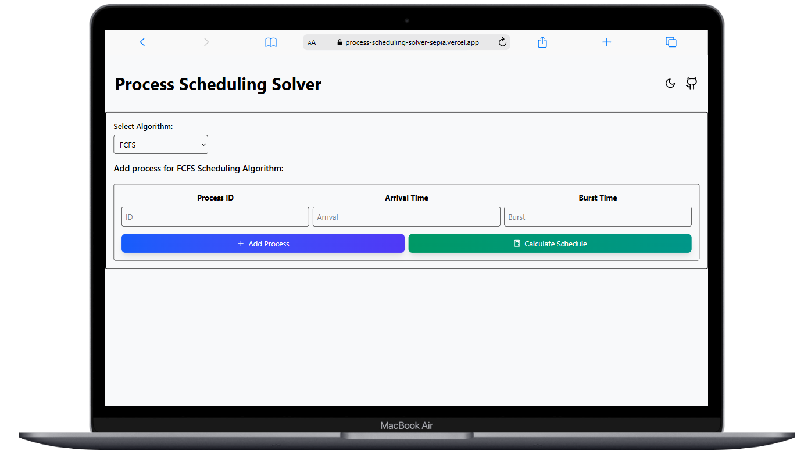

# Process Scheduling Solver

A web-based tool designed to simulate various CPU scheduling algorithms. It allows users to input process details and visualize scheduling through Gantt charts, while also calculating key metrics like Turnaround Time (TAT) and Waiting Time (WT).

## 🌐 Live Demo

Access the live application here: [process-scheduling-solver-sepia.vercel.app](https://process-scheduling-solver-sepia.vercel.app)

